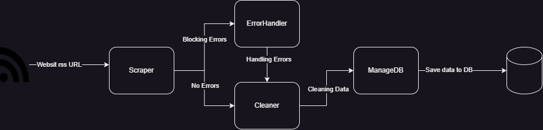

# SCRAPE NEWS
This project built to scrape recent news from the populate website and save this data in
a database. And use it for other project like website that group (**with permission**), or use it to check recent news
and also to use them to analyse the top news in the world.
## How the program work?
The process of extracting data follow 4 station, like diagram below represent:

1. **Scraper** is the first step our program pass it. In this state we request the rss url to get 
data [news].
2. **ErrorHandler** It Receives problems encountered by scraper, like 403 status code or 5xx
and try to handle it.
3. **Cleaner** We need to be sure that data in the DB clean data not garbage. This is the role of this piece to make sure that data respect bunche of rules.
4. **ManageDB** is the wall between the program and database, used to save data scraped to database

## Scraper

The responsibility of Scraper is to send requests to the URL given, and return a dict object called data this object
has a status take _True_ or _False_ represent if the data exist or problem.
### Status False
This is the structure of the dictionary:
```python
data = {
    'status': False,
    'data': {
        'channel_url': 'https://www.example.com/',
        'work_on': 'https://www.example.com/feed',
        'date': 1725783088,
        'error': 403,
        'user_agent': 'user-agent used to sent the request',
        'proxy': 'proxy if use it to send the request',
    }
}
```
**keys** `channel_url`  and `work_on` represent the base URL of the channel of the news and its RSS feed respectively.
`user_agent` and `proxy` used to check the status of request or to define the exact problem where. The important key is 
`error` this one represent the status code returned by the server, this key help us to define the methods to handle the problem
the errors we handle in this program in all the time is `403`, there is also others but this one is popular.
>📝**Note:** There are other return of the Scraper, returned when an error accused like when there is a problem in connexion:
```python
data = {
'status': False,
'data': {
    'channel_url': 'https://www.example.com/',
    'work_on': 'https://www.example.com/feed',
    'date': 1725783088,
    'error': 0,
}
}
```
### Status True
When you see this status, Scraper get the data from the URL. The following is the structure of the dictionary object returned by the Scraper and the Structure of news data:
```python
# data structure
data = {
'status': True,
'data': {
    'channel_url': 'https://www.example.com/',
    'work_on': 'https://www.example.com/feed',
    'date': 1725783088,
    'number_of_news': 30,
    'news': news,
}
}
```
The key `news` is a list of news, that extracted from the RSS feed corespondent to channel. Information related to a news
is `title`, `description`, `publish_date`, `link` and `media`. News structure is:
```python
news1 = {
    'title': 'title',
    'link': 'link',
    'publish_date': 'publish_date',
    'description': 'description',
    'media': 'media',
},
```
>📝**Note:** An important things to mention is that every channel use a timezone different that make the `publish_date` differ
> that why we use a method `Scraper.__convert_date_to_utc` to convert the `publish_date` to UTC, and make it unique.

Media [always Image] sometimes it note exist in the RSS feed, if this is the case we get the media from the article `link`
and get the lead image, the method that do that is `Scraper.get_media`. After we get the media we download the image using 
`Scraper.save_image`.

## ErrorHandler

Diagram above show the process of solving 403 status code. This status mean that the server you request detect you as bot
and it response with this status. The process we use is very simple, it works very well in our case.
We use a Headless browser `playwright` (because the major of news website did not block headless browser) we send the request to get the cookies
we use them to send other requests to the same domain, and them save them for recent requests. The goal is the content, we send our request with the cookies get it
using HTTP client (`httpx`) this just to speed the process, if that did not work we get the content using `playwright`.
If all this process did not success we save this URL as not handler for later.
>📝**Note:** 403 error is the common error that will make the process stop. There also other method that handle 5xx
> problem `handle_server_echec`. And other for proxy, user-agent rotating `get_request_id`. You can use them if needed.

## Cleaner

Cleaner pass data scraped from 3 steps to ensure that the elements describe a news clean.
1. **Step-One: Eliminate HTML Decoders**
In this step the cleaner eliminate HTML decoders and replace it with its correspondent value.
2. **Step-Two: Eliminate HTML tags**
Some channels in the RSS feed use tags in the content of the item. This step ensure that all the tags eliminated and let only the content.
3. **Step-Three: Check Patter**
In this phase Cleaner check if the element respect a pattern, like for like use the pattern `r"^(https?://[a-z0-9-]+)(\.[a-z0-9-]+)+(:\d+)?(/[^ ]*)?$",` this step ensure that the data in the element the exact one.
If one element of the news fail in this check the news mentioned as _NOT CLEANED NEWS_, and save in the file `news_not_cleaned.json`.

## ManageDB
This station take the cleaned data and save it in the database. First save the channels and then news after it scraped
the `number_of_news` of every channel only calculate the cleaned news.
## Buffering
All the file used in the program has a buffer to hold the data where the program running and when it reach the end
save all the data in the buffer to the file. Using two type of buffers `CSVBuffer` and `JSONBuffer`.
## Conclusion
Before you start using the code make sure that you fill `channels` with all the channels where you want to scrape the data
and also in `ErrorHandler` fill `chrome_path` or you can change it your prefer browser.